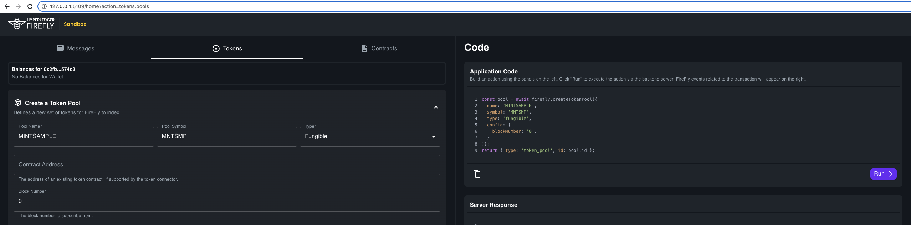

# Mint Token UI

This sample contains a frontend (React) application that demonstrates minting an ERC20 token using FireFly.

It can be used standalone to mint tokens using a FireFly token pool, or in conjunction with the [mint-token-cli](../mint-token-cli)
sample which will wait for events from the UI and display them in a terminal. This demonstrates how one application
can wait for another to perform transactions on the blockchain and optionally act on them by initiaing their own
transactions.

## Setup

To run the application, you will require a 1 party FireFly system running
locally on ports 5000. The easiest way to set this up is with the
[FireFly CLI](https://github.com/hyperledger/firefly-cli):

```
ff init mint-token-stack 1
ff start mint-token-stack
```

Once you have a stack you will need to use the FireFly sandbox (or APIs) to create a token pool
called MINTSAMPLE:



To create a token pool for an existing ERC20 contract on a public chain you must provide the contract address and block number for the contract.

## Running

Once the FireFly stack is ready, set up and run the sample with:

```
npm install
npm start
```
